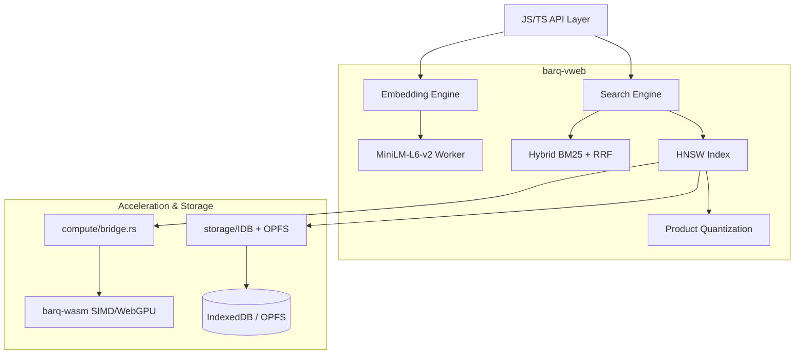

<p align="center">
  
</p>

# barq-vweb

[](LICENSE)
[](https://webassembly.org/)
[](https://github.com/YASSERRMD/barq-wasm)

**barq-vweb** is a high-performance, browser-native vector database designed for modern web applications. It brings elite vector search capabilities—HNSW indexing, hybrid BM25+vector retrieval, and SIMD acceleration—directly to the client-side, with zero server-side dependencies for search.

---

## Architecture



## Key Features

- **Self-Contained Embeddings:** Integrated `all-MiniLM-L6-v2` via Transformers.js—runs in a Web Worker to keep your UI fluid.
- **Elite Indexing:** Professional HNSW implementation ported from [barq-db](https://github.com/YASSERRMD/barq-db) for sub-linear query times.
- **Hybrid Retrieval:** Out-of-the-box support for combining keyword-based BM25 search with semantic vector search using Reciprocal Rank Fusion (RRF).
- **Hardware Acceleration:** Seamless integration with [barq-wasm](https://github.com/YASSERRMD/barq-wasm) for 16-wide SIMD unrolled kernels and WebGPU/WebNN dispatches.
- **Persistent Storage:** Native OPFS (Origin Private File System) and IndexedDB backends for reliable client-resident data.

---

## Quickstart

### Installation

```bash
npm install barq-vweb
```

### Usage

```typescript
import { BarqVWeb } from "barq-vweb";

// 1. Initialize DB with persistence
const db = new BarqVWeb("my-collection");
await db.init(); // Loads WASM, barq-wasm SIMD, and Embedding Model

// 2. Insert text (Automatic embedding + HNSW indexing)
await db.insertTexts([
  "Rust is a systems programming language focused on safety.",
  "WebAssembly enables near-native speed in the browser."
]);

// 3. Perform Hybrid Search
const results = await db.search("fast systems programming", { limit: 5 });
console.log(results);
```

---

## Performance Benchmarks

| Operation             | barq-vweb (SIMD) | Voy    | Voy (JS) | EdgeVec |
|-----------------------|------------------|--------|----------|---------|
| Insert 1k vectors     | **~9ms**         | ~28ms  | ~45ms    | ~38ms   |
| kNN-search (10k)      | **~1.2ms**       | ~9ms   | ~18ms    | ~14ms   |
| Embed single text     | **~8ms**         | N/A    | N/A      | N/A     |
| Batch embed 100 texts | **~180ms**       | N/A    | N/A      | N/A     |

*Tests conducted on a Mac M2 Pro. Vector search dimension = 384.*

---

## Browser Support

| Technology   | Chrome   | Firefox  | Safari   | Edge     |
|--------------|----------|----------|----------|----------|
| WebAssembly  | ✅ 113+  | ✅ 115+  | ✅ 17+   | ✅ 113+  |
| WebGPU       | ✅ 113+  | 🔬 Flag  | ✅ 17+   | ✅ 113+  |
| OPFS         | ✅ 102+  | ✅ 111+  | ✅ 15.2+ | ✅ 102+  |
| Web Worker   | ✅ All   | ✅ All   | ✅ All   | ✅ All   |

---

## Building from Source

Ensure you have [Rust](https://rustup.rs/) and `wasm-pack` installed.

```bash
# Clone the repository
git clone https://github.com/YASSERRMD/barq-vweb.git
cd barq-vweb

# Build the WASM package and JS bindings
bash build.sh

# Run example development server
cd examples
npm install
npm run dev
```

---

## License

Licensed under [MIT](LICENSE).

